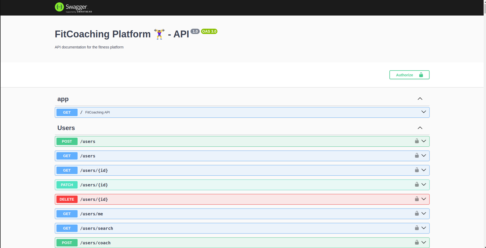

# FitCoaching Platform 🏋️‍♀️ - Backend

## Description

Ce projet est une plateforme sociale de fitness qui permet aux utilisateurs de se connecter, de suivre des coachs et des nutritionnistes, de participer à des formations et de suivre leur progression.

## Fonctionnalités

* **Authentification:**
    * Inscription
    * Connexion
    * Réinitialisation de mot de passe
    * Vérification d'e-mail
    * Rafraîchissement de token
* **Gestion des utilisateurs:**
    * Création, lecture, mise à jour, suppression d'utilisateurs
    * Création de profils de coachs
* **Gestion des coachs:**
    * Création, lecture, mise à jour, suppression de coachs
    * Gestion des qualifications et des spécialisations
    * Gestion des évaluations
* **Gestion du contenu:**
    * Création, lecture, mise à jour, suppression de contenu (formations, programmes d'entraînement, conseils)
    * Association de contenus à des objectifs fitness
    * Gestion des catégories de contenu
* **Objectifs fitness:**
    * Création, lecture, mise à jour, suppression d'objectifs fitness
    * Association de contenus à des objectifs fitness
    * Association d'exercices à des objectifs fitness
* **Défis:**
    * Création, lecture, mise à jour, suppression de défis associés aux contenus
* **Étapes de contenu:**
    * Création, lecture, mise à jour, suppression d'étapes pour les contenus
* **Sessions d'entraînement:**
    * Création, lecture, mise à jour, suppression de sessions d'entraînement
    * Association de sessions à des contenus
    * Suivi de la participation des utilisateurs
* **Paiements:**
    * Intégration de Stripe pour les paiements par carte de crédit
    * Gestion des remboursements
* **Mesures corporelles:**
    * Enregistrement des mesures corporelles des utilisateurs
* **Progression d'exercice:**
    * Suivi de la progression des utilisateurs dans les exercices
* **Programmes nutritionnels:**
    * Création, lecture, mise à jour, suppression de programmes nutritionnels
    * Association de contenus à des programmes nutritionnels
    * Association d'exercices à des programmes nutritionnels
    * Définition des détails nutritionnels
    * Suivi de l'engagement nutritionnel
    * Suivi de la progression nutritionnelle
    * Gestion des évaluations
* **Conversations privées:**
    * Possibilité pour les utilisateurs de discuter en privé avec les coachs
* **Recommandations:**
    * Possibilité pour les utilisateurs de recommander des coachs à d'autres utilisateurs
* **Évaluations de sessions d'entraînement:**
    * Possibilité pour les utilisateurs de laisser des évaluations sur les sessions d'entraînement
* **Programmes d'entraînement:**
    * Inscription des utilisateurs aux programmes d'entraînement
    * Suivi de la progression dans les programmes
    * Enregistrement des performances
* **Liens de contenu d'entraînement:**
    * Association de contenus spécifiques à des sessions d'entraînement
* **Participation aux sessions d'entraînement:**
    * Enregistrement de la participation des utilisateurs aux sessions d'entraînement
* **Programmes d'affiliation:**
    * Création de programmes d'affiliation pour le parrainage de contenus
    * Génération de liens d'affiliation par les utilisateurs
    * Suivi des ventes générées par les liens d'affiliation
* **Notifications:**
    * Envoi de notifications aux utilisateurs
    * Gestion des notifications non lues
* **Gestion des abonnements:**
    * Création, gestion et suivi des plans d'abonnement

## Technologies utilisées

* **Node.js:** Environnement d'exécution JavaScript côté serveur.
* **NestJS:** Framework Node.js pour la création d'applications évolutives et robustes.
* **TypeORM:** ORM pour la gestion des relations entre les données.
* **TypeScript:** Langage de programmation typé qui améliore la qualité du code.
* **JWT:** Système d'authentification basé sur des jetons.
* **PostgreSQL:** Base de données SQL pour stocker les données. (ou SQLite par défaut)
* **Swagger:** Outil de documentation d'API.

## Instructions

**Configuration de la base de données:**

1. Remplacez les valeurs fictives dans le fichier `.env` par vos propres informations de connexion à la base de données, les clés API Stripe, etc.
2. Assurez-vous d'avoir installé le pilote de base de données approprié (e.g., pg pour PostgreSQL). SQLite est pris en charge par défaut.

**Création de la base de données:**

1. Exécutez la commande `npm run migration:run` pour créer les tables de la base de données.

**Démarrage de l'application:**

1. Exécutez la commande `npm run start:dev` pour démarrer l'application en mode développement.

**Documentation:**

* [Swagger](http://localhost:3000/api)

**Tests unitaires:**

1. Exécutez la commande `npm run test` pour exécuter tous les tests unitaires.


## Travaux restant à faire:

* **Implémenter la logique métier dans les autres modules de votre application.**
* **Completer et executer les tests unitaires** pour tous les modules, en particulier pour le module principal.
* **Configurer votre application pour la production:** Définir les variables d'environnement, les configurations de serveur et de base de données.
* **Déployer votre application:**  Choisir un environnement d'hébergement (Heroku, AWS, etc.) et déployer votre application.
verture de tests unitaires pour garantir la qualité du code.

## Utilisation:

* Utilisez l'API RESTful pour interagir avec les différentes fonctionnalités de la plateforme.
* Utilisez les outils de documentation Swagger pour explorer l'API et obtenir des informations détaillées sur les endpoints.

## Structure du projet:

```
fitness-platform
├── src
│ ├── main.ts
│ ├── app.module.ts
│ ├── config
│ │ └── configuration.ts
│ ├── shared
│ │ ├── guards
│ │ │ ├── auth.guard.ts
│ │ │ └── role.guard.ts
│ │ ├── decorators
│ │ │ └── roles.decorator.ts
│ │ ├── exceptions
│ │ │ ├── base.exception.ts
│ │ │ └── unauthorized.exception.ts
│ │ ├── dto
│ │ │ ├── user.dto.ts
│ │ │ └── coach.dto.ts
│ │ ├── services
│ │ │ ├── auth.service.ts
│ │ │ └── mail.service.ts
│ │ ├── entities
│ │ │ ├── user.entity.ts
│ │ │ └── coach.entity.ts
│ │ ├── utils
│ │ │ └── validate-email.util.ts
│ │ └── constants
│ │ └── roles.ts
│ ├── users
│ │ ├── users.module.ts
│ │ ├── users.controller.ts
│ │ ├── users.service.ts
│ │ └── dto
│ │ └── update-user.dto.ts
│ ├── coaches
│ │ ├── coaches.module.ts
│ │ ├── coaches.controller.ts
│ │ ├── coaches.service.ts
│ │ └── dto
│ │ └── create-coach.dto.ts
│ ├── content
│ │ ├── content.module.ts
│ │ ├── content.controller.ts
│ │ ├── content.service.ts
│ │ └── dto
│ │ └── create-content.dto.ts
│ ├── auth
│ │ ├── auth.module.ts
│ │ ├── auth.controller.ts
│ │ ├── auth.service.ts
│ │ └── dto
│ │ └── login.dto.ts
│ ├── goals
│ │ ├── goals.module.ts
│ │ ├── goals.controller.ts
│ │ ├── goals.service.ts
│ │ └── dto
│ │ └── create-goal.dto.ts
│ ├── challenges
│ │ ├── challenges.module.ts
│ │ ├── challenges.controller.ts
│ │ ├── challenges.service.ts
│ │ └── dto
│ │ └── create-challenge.dto.ts
│ ├── stages
│ │ ├── stages.module.ts
│ │ ├── stages.controller.ts
│ │ ├── stages.service.ts
│ │ └── dto
│ │ └── create-stage.dto.ts
│ ├── sessions
│ │ ├── sessions.module.ts
│ │ ├── sessions.controller.ts
│ │ ├── sessions.service.ts
│ │ └── dto
│ │ └── create-session.dto.ts
│ ├── payments
│ │ ├── payments.module.ts
│ │ ├── payments.controller.ts
│ │ ├── payments.service.ts
│ │ └── dto
│ │ └── create-payment.dto.ts
│ ├── bodymeasurements
│ │ ├── bodymeasurements.module.ts
│ │ ├── bodymeasurements.controller.ts
│ │ ├── bodymeasurements.service.ts
│ │ └── dto
│ │ └── create-measurement.dto.ts
│ ├── progress
│ │ ├── progress.module.ts
│ │ ├── progress.controller.ts
│ │ ├── progress.service.ts
│ │ └── dto
│ │ └── update-progress.dto.ts
│ ├── news
│ │ ├── news.module.ts
│ │ ├── news.controller.ts
│ │ ├── news.service.ts
│ │ └── dto
│ │ └── create-news.dto.ts
│ ├── notifications
│ │ ├── notifications.module.ts
│ │ ├── notifications.controller.ts
│ │ ├── notifications.service.ts
│ │ └── dto
│ │ └── create-notification.dto.ts
│ ├── subscriptions
│ │ ├── subscriptions.module.ts
│ │ ├── subscriptions.controller.ts
│ │ ├── subscriptions.service.ts
│ │ └── dto
│ │ └── create-subscription.dto.ts
│ ├── coachfollows
│ │ ├── coachfollows.module.ts
│ │ ├── coachfollows.controller.ts
│ │ ├── coachfollows.service.ts
│ │ └── dto
│ │ └── follow-coach.dto.ts
│ ├── coachqualifications
│ │ ├── coachqualifications.module.ts
│ │ ├── coachqualifications.controller.ts
│ │ ├── coachqualifications.service.ts
│ │ └── dto
│ │ └── create-qualification.dto.ts
│ ├── coachspecializations
│ │ ├── coachspecializations.module.ts
│ │ ├── coachspecializations.controller.ts
│ │ ├── coachspecializations.service.ts
│ │ └── dto
│ │ └── create-specialization.dto.ts
│ ├── coachratings
│ │ ├── coachratings.module.ts
│ │ ├── coachratings.controller.ts
│ │ ├── coachratings.service.ts
│ │ └── dto
│ │ └── create-coach-rating.dto.ts
│ ├── contentratings
│ │ ├── contentratings.module.ts
│ │ ├── contentratings.controller.ts
│ │ ├── contentratings.service.ts
│ │ └── dto
│ │ └── create-content-rating.dto.ts
│ ├── contentreviews
│ │ ├── contentreviews.module.ts
│ │ ├── contentreviews.controller.ts
│ │ ├── contentreviews.service.ts
│ │ └── dto
│ │ └── create-content-review.dto.ts
│ ├── nutritionprograms
│ │ ├── nutritionprograms.module.ts
│ │ ├── nutritionprograms.controller.ts
│ │ ├── nutritionprograms.service.ts
│ │ └── dto
│ │ └── create-nutrition-program.dto.ts
│ ├── nutritiondetails
│ │ ├── nutritiondetails.module.ts
│ │ ├── nutritiondetails.controller.ts
│ │ ├── nutritiondetails.service.ts
│ │ └── dto
│ │ └── create-nutrition-detail.dto.ts
│ ├── nutritionprogramreviews
│ │ ├── nutritionprogramreviews.module.ts
│ │ ├── nutritionprogramreviews.controller.ts
│ │ ├── nutritionprogramreviews.service.ts
│ │ └── dto
│ │ └── create-nutrition-program-review.dto.ts
│ ├── privatediscussions
│ │ ├── privatediscussions.module.ts
│ │ ├── privatediscussions.controller.ts
│ │ ├── privatediscussions.service.ts
│ │ └── dto
│ │ └── create-private-discussion.dto.ts
│ ├── recommendations
│ │ ├── recommendations.module.ts
│ │ ├── recommendations.controller.ts
│ │ ├── recommendations.service.ts
│ │ └── dto
│ │ └── create-recommendation.dto.ts
│ ├── sessionreviews
│ │ ├── sessionreviews.module.ts
│ │ ├── sessionreviews.controller.ts
│ │ ├── sessionreviews.service.ts
│ │ └── dto
│ │ └── create-session-review.dto.ts
│ ├── usernutrition
│ │ ├── usernutrition.module.ts
│ │ ├── usernutrition.controller.ts
│ │ ├── usernutrition.service.ts
│ │ └── dto
│ │ └── join-nutrition-program.dto.ts
│ ├── usernutritionprogress
│ │ ├── usernutritionprogress.module.ts
│ │ ├── usernutritionprogress.controller.ts
│ │ ├── usernutritionprogress.service.ts
│ │ └── dto
│ │ └── create-nutrition-progress.dto.ts
│ ├── userprograms
│ │ ├── userprograms.module.ts
│ │ ├── userprograms.controller.ts
│ │ ├── userprograms.service.ts
│ │ └── dto
│ │ └── join-program.dto.ts
│ ├── trainingcontentlinks
│ │ ├── trainingcontentlinks.module.ts
│ │ ├── trainingcontentlinks.controller.ts
│ │ ├── trainingcontentlinks.service.ts
│ │ └── dto
│ │ └── link-content-to-session.dto.ts
│ ├── trainingsessions
│ │ ├── trainingsessions.module.ts
│ │ ├── trainingsessions.controller.ts
│ │ ├── trainingsessions.service.ts
│ │ └── dto
│ │ └── attend-session.dto.ts
│ ├── affiliateprograms
│ │ ├── affiliateprograms.module.ts
│ │ ├── affiliateprograms.controller.ts
│ │ ├── affiliateprograms.service.ts
│ │ └── dto
│ │ └── create-affiliate-program.dto.ts
│ ├── affiliatelinks
│ │ ├── affiliatelinks.module.ts
│ │ ├── affiliatelinks.controller.ts
│ │ ├── affiliatelinks.service.ts
│ │ └── dto
│ │ └── create-affiliate-link.dto.ts
│ ├── affiliatesales
│ │ ├── affiliatesales.module.ts
│ │ ├── affiliatesales.controller.ts
│ │ ├── affiliatesales.service.ts
│ │ └── dto
│ │ └── create-affiliate-sale.dto.ts
│ ├── database
│ │ ├── database.module.ts
│ │ └── database.providers.ts
│ ├── app.service.ts
│ ├── exceptions
│ │ └── not-found.exception.ts
│ └── shared
│ ├── shared.module.ts
│ ├── guards
│ │ ├── public.guard.ts
│ │ ├── auth.guard.ts
│ │ └── role.guard.ts
│ ├── decorators
│ │ └── roles.decorator.ts
│ ├── exceptions
│ │ ├── base.exception.ts
│ │ └── unauthorized.exception.ts
│ ├── dto
│ │ ├── user.dto.ts
│ │ └── coach.dto.ts
│ ├── services
│ │ ├── auth.service.ts
│ │ └── mail.service.ts
│ ├── entities
│ │ ├── user.entity.ts
│ │ └── coach.entity.ts
│ ├── utils
│ │ └── validate-email.util.ts
│ └── constants
│ └── roles.ts
├── test
│ ├── app.e2e-spec.ts
│ ├── users
│ │ ├── users.service.spec.ts
│ │ └── users.controller.spec.ts
│ ├── coaches
│ │ ├── coaches.service.spec.ts
│ │ └── coaches.controller.spec.ts
│ ├── content
│ │ ├── content.service.spec.ts
│ │ └── content.controller.spec.ts
│ ├── auth
│ │ ├── auth.service.spec.ts
│ │ └── auth.controller.spec.ts
│ ├── goals
│ │ ├── goals.service.spec.ts
│ │ └── goals.controller.spec.ts
│ ├── challenges
│ │ ├── challenges.service.spec.ts
│ │ └── challenges.controller.spec.ts
│ ├── stages
│ │ ├── stages.service.spec.ts
│ │ └── stages.controller.spec.ts
│ ├── sessions
│ │ ├── sessions.service.spec.ts
│ │ └── sessions.controller.spec.ts
│ ├── payments
│ │ ├── payments.service.spec.ts
│ │ └── payments.controller.spec.ts
│ ├── bodymeasurements
│ │ ├── bodymeasurements.service.spec.ts
│ │ └── bodymeasurements.controller.spec.ts
│ ├── progress
│ │ ├── progress.service.spec.ts
│ │ └── progress.controller.spec.ts
│ ├── news
│ │ ├── news.service.spec.ts
│ │ └── news.controller.spec.ts
│ ├── notifications
│ │ ├── notifications.service.spec.ts
│ │ └── notifications.controller.spec.ts
│ ├── subscriptions
│ │ ├── subscriptions.service.spec.ts
│ │ └── subscriptions.controller.spec.ts
│ ├── coachfollows
│ │ ├── coachfollows.service.spec.ts
│ │ └── coachfollows.controller.spec.ts
│ ├── coachqualifications
│ │ ├── coachqualifications.service.spec.ts
│ │ └── coachqualifications.controller.spec.ts
│ ├── coachspecializations
│ │ ├── coachspecializations.service.spec.ts
│ │ └── coachspecializations.controller.spec.ts
│ ├── coachratings
│ │ ├── coachratings.service.spec.ts
│ │ └── coachratings.controller.spec.ts
│ ├── contentratings
│ │ ├── contentratings.service.spec.ts
│ │ └── contentratings.controller.spec.ts
│ ├── contentreviews
│ │ ├── contentreviews.service.spec.ts
│ │ └── contentreviews.controller.spec.ts
│ ├── nutritionprograms
│ │ ├── nutritionprograms.service.spec.ts
│ │ └── nutritionprograms.controller.spec.ts
│ ├── nutritiondetails
│ │ ├── nutritiondetails.service.spec.ts
│ │ └── nutritiondetails.controller.spec.ts
│ ├── nutritionprogramreviews
│ │ ├── nutritionprogramreviews.service.spec.ts
│ │ └── nutritionprogramreviews.controller.spec.ts
│ ├── privatediscussions
│ │ ├── privatediscussions.service.spec.ts
│ │ └── privatediscussions.controller.spec.ts
│ ├── recommendations
│ │ ├── recommendations.service.spec.ts
│ │ └── recommendations.controller.spec.ts
│ ├── sessionreviews
│ │ ├── sessionreviews.service.spec.ts
│ │ └── sessionreviews.controller.spec.ts
│ ├── usernutrition
│ │ ├── usernutrition.service.spec.ts
│ │ └── usernutrition.controller.spec.ts
│ ├── usernutritionprogress
│ │ ├── usernutritionprogress.service.spec.ts
│ │ └── usernutritionprogress.controller.spec.ts
│ ├── userprograms
│ │ ├── userprograms.service.spec.ts
│ │ └── userprograms.controller.spec.ts
│ ├── trainingcontentlinks
│ │ ├── trainingcontentlinks.service.spec.ts
│ │ └── trainingcontentlinks.controller.spec.ts
│ ├── trainingsessions
│ │ ├── trainingsessions.service.spec.ts
│ │ └── trainingsessions.controller.spec.ts
│ ├── affiliateprograms
│ │ ├── affiliateprograms.service.spec.ts
│ │ └── affiliateprograms.controller.spec.ts
│ ├── affiliatelinks
│ │ ├── affiliatelinks.service.spec.ts
│ │ └── affiliatelinks.controller.spec.ts
│ ├── affiliatesales
│ │ ├── affiliatesales.service.spec.ts
│ │ └── affiliatesales.controller.spec.ts
│ └── shared
│ └── shared.module.spec.ts
├── tsconfig.json
├── jest.config.js
├── .eslintrc.json
├── package.json
├── .gitignore
└── README.md
```
